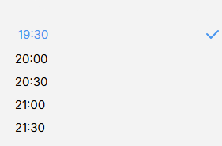

# Todois Litte Front


*hoursSelector* -> Array que contiene las horas del listado

```javascript 
const [hoursSelector, setHoursSelector] = useState<string[]>([]);
```




👉 Se genera en **generateHours**


## Hora del input

```
  const [hour, setHour] = useState({
    hour_hh: "",
    separator: ":",
    hour_mm: "",
  });
``` 

## Input de horas

*handleKeyDown*


